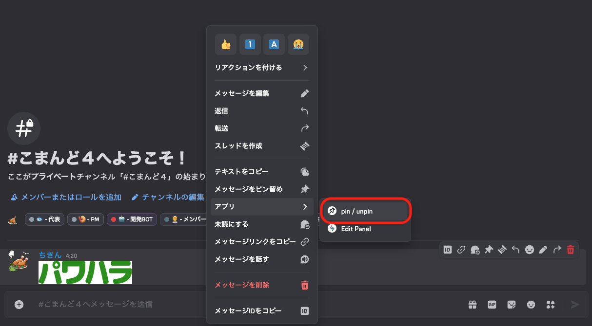

# メッセージをピン留めしよう

メッセージをピン留めする方法は２つあります。

## メッセージアプリを使用する方法

1. ピン留めしたいメッセージを右クリック（長押し）する。
2. 「アプリ」から`pin / unpin`を選択する。




## スラッシュコマンドを使用する方法

下記のコマンドのオプション`value`にピン留めしたいメッセージのメッセージURLを入力することで、メッセージをピン留めすることが可能です。

```
/pin
```

:::info


BOTが入力されたメッセージURLからメッセージを読み取れない場合にはエラーが発生します。

:::
