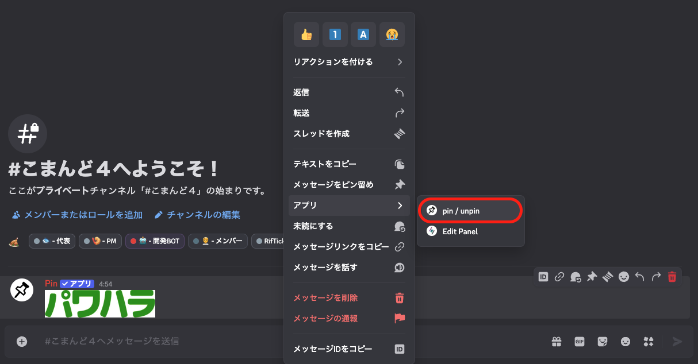

# ピン留めを解除しよう

ピン留めを解除する方法は２つあります。


## メッセージアプリを使用する方法

1. ピン留めメッセージを右クリック（長押し）する。
2. 「アプリ」から`pin / unpin`を選択する。




## スラッシュコマンドを使用する方法

- ピン留めメッセージがあるチャンネルで下記のコマンドを実行する
- コマンドのオプション`channel`に、ピン留めメッセージがあるチャンネルを指定して実行する

```
/unpin
```
