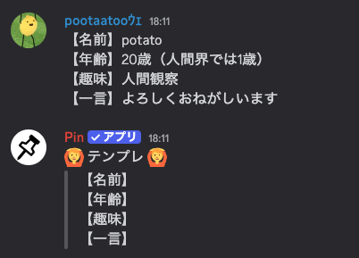

# 🤖 Pin

## 名称

Pin（ピン）

## 説明

このBOTは特定のメッセージをチャンネルの一番下に固定することができます。

例えば、`#自己紹介`チャンネルで自己紹介文のテンプレートをユーザーに表示したい場合、以下のように設定することができます。

## 導入

こちらのリンクからBOTをサーバーに招待することができます。

https://discord.com/oauth2/authorize?client_id=1299604436577943572

## 必要権限について

Pin は以下の権限を要求しています。

- チャンネルを見る
    - チャンネルにアクセスするため
- メッセージを送信
    - ピン留めしたメッセージを送信するため
- 埋め込みリンク
    - ピン留めしたメッセージを送信するため
- ファイルを添付
    - ピン留めしたメッセージを送信するため
- メッセージ履歴を見る
    - ピン留めメッセージを取得するため
